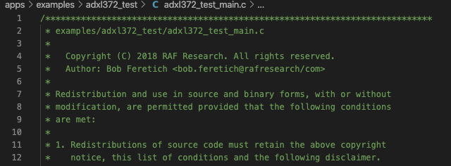
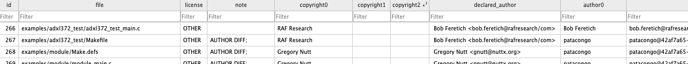

# authors-tool

Scripts to help clearing the licenses for NuttX 

## Functions

### Database
The script authors-db.sh extracts copyright owners and declared authors from the comment blocks at the start of a file. The top 3 (number of lines edited) contributors to the file, determined by git log, are also recorded. All data is stored in a SQLite3 database for ease of use.

Comments like:

are converted to:

The data fields explained:

|    field name  | explanation |
| -------------- | ----------- |
| id   | index(auto-generated) |
| file | file path |
| license | APACHE or OTHER |
| note | warnings: CP>3 indicates more than 3 copyright owners, DA>100 indicates long declared author string(bug), AUTHOR_DIFF indicates top 1 contributor is different from declared author(file may be copied from sw. else) |
| copyright0 | first copyright owner |
| copyright1 | second copyright owner |
| copyright2 | third copyright owner |
| declared_author | authors declared in file |
| author0 | first contributor | 
| email0 | first contributor's email | 
| lines0 | first contributor's total edited lines | 
| author1 | second contributor | 
| email1 | second contributor's email | 
| lines1 | second contributor's total edited lines | 
| author2 | third contributor | 
| email2 | third contributor's email | 
| lines2 | third contributor's total edited lines | 

**Bugs**:
 - Copyright only extracts first two words of the owner name
 - Sometimes copyright contains the whole line
 - Sometimes copyright0 is absolutely wrong
 - Declared authors may contain extra characters between names

### Names

 The Python script process.py uses some NLP library to filter out names from text log. Put changelog.sh, process.py and <somelog.txt> in the same folder and run:
 
     ./changelog.sh <somelog.txt>
     
 and you will get a names.txt with names appeared in the log.(Manual polishment required)
 
## Prerequisites

Install SQLite3:

    sudo apt-get install sqlite3
    
## Usage:

Put the scripts in the root folder of git repo and run ./loop.sh for recursive processing or ./authors.sh <Filename> for a single file.

## SQLite Tips

I'm currently using the [DB Browser for SQLite](https://sqlitebrowser.org/dl/) for browsing, You can also execute direct SQL commands in GUI or CLI, such as:

    select * from n where license="OTHER" and copyright0!="Gregory Nutt" and copyright0!='' and copyright1!="Gregory Nutt";

will return all items that doesn't seem to belong to Greg (considering copyright0 may be wrong)

## Results

The results for latest release as of Aug 3,2020 has been uploaded as authors-nuttx.db and authors-apps.db, respectively.

The names in [ChangeLog](https://github.com/apache/incubator-nuttx/blob/nuttx-9.0.0-RC0/ChangeLog) from NuttX 9.0.0 RC0 is in names-changelog.txt. 

And the names in git log (nuttx and apps combined) of master branch at Aug 6,2020 is in names-gitlog.txt.

### name-commits.txt

    git log --no-merges --author=patacongo --pretty=format:"%h %s" > gp.txt
    cat ng2.txt | xargs -n 1 -I pp grep "pp" gp.txt > commits-patacongo.txt
    ./name-commits.sh ng2.txt name-commits.txt commits-patacongo.txt
    ./name-commits.sh ng3.txt name-commits-full.txt commits-patacongo.txt # ng3.txt includes all git commit authors
